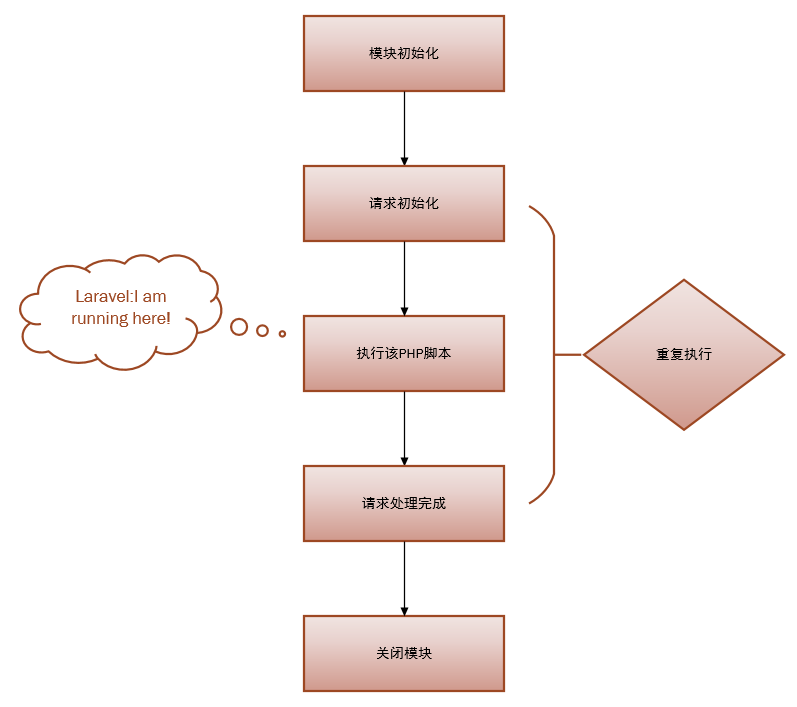
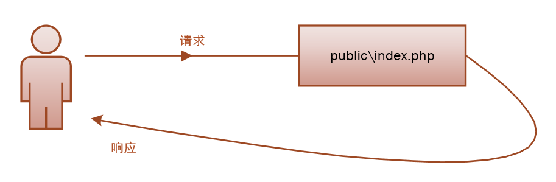
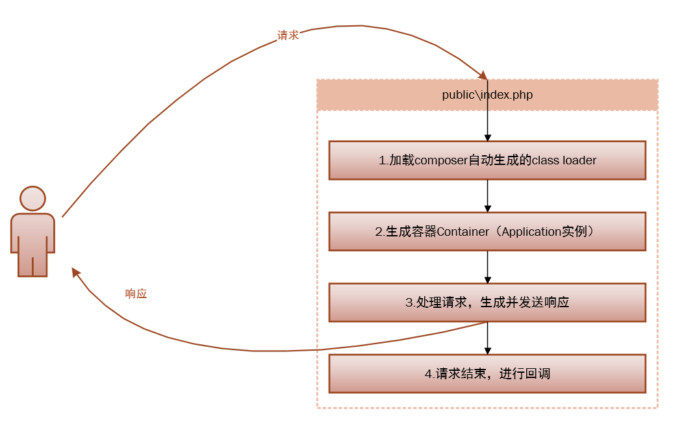
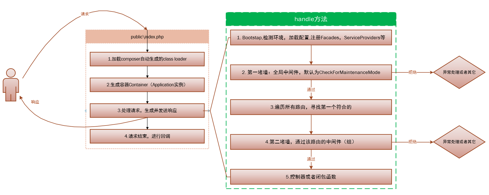

# 一起学laravel

## 1. laravel是什么？

官方介绍

**The PHP Framework for Web Artisans**

翻译成中文

**Web工匠的PHP框架**

有几个问题我们需要弄明白：

- 什么是Web？
- 什么是PHP？
- 什么是Framework？

### 1.1 什么是Web？

维基百科

> 万维网（英语：World Wide Web），亦作“WWW”、“Web”，是一个透过互联网访问的，由许多互相链接的超文本组成的系统。

百度百科

> web（World Wide Web）即全球广域网，也称为万维网，它是一种基于超文本和HTTP的、全球性的、动态交互的、跨平台的分布式图形信息系统。是建立在Internet上的一种网络服务，为浏览者在Internet上查找和浏览信息提供了图形化的、易于访问的直观界面，其中的文档及超级链接将Internet上的信息节点组织成一个互为关联的网状结构。

知乎

> Web就是在Http协议基础之上, 利用浏览器进行访问的网站. Web Page指网站内的网页. 我们常说的WWW(World Wide Web 万维网)就是这个概念下的内容. 而Internet(互联网)则是一个更大的概念, Internet上不只有Web, 还有FTP, P2P,Email, 或者App等其他多种不同的互联网应用方式. Web只是其中最广泛的一种. Internet的概念要大于Web. "Web已死 Internet永生", 意思是传统网站的重要性可能会降低, 新生的互联网服务可能会取代其重要性. 虽然单纯从流量上看, Web已经不是最大的互联网应用. 但由于其主体是文本(或者说是超文本hypertext), 流量开销本身就远小于视频等其他应用. Web可能仍是最最重要的互联网载体.


什么是PHP

官网介绍


> PHP is a popular general-purpose scripting language that is especially suited to web development.Fast, flexible and pragmatic, PHP powers everything from your blog to the most popular websites in the world.

谷歌翻译

> PHP是一种流行的通用脚本语言，特别适用于Web开发。快速，灵活和务实，PHP支持从您的博客到世界上最受欢迎的网站的所有内容。划重点 快速 灵活 务实 流行 通用 脚本语言 特别适用于Web开发.


什么是框架

维基百科

> 软件框架（software framework），通常指的是为了实现某个业界标准或完成特定基本任务的软件组件规范，也指为了实现某个软件组件规范时，提供规范所要求之基础功能的软件产品。

知乎

> 框架（Framework）是一个框子——指其约束性，也是一个架子——指其支撑性。IT语境中的框架，特指为解决一个开放性问题而设计的具有一定约束性的支撑结构。在此结构上可以根据具体问题扩展、安插更多的组成部分，从而更迅速和方便地构建完整的解决问题的方案。


那么laravel是什么呢

看看官方的副标题

> Laravel is a web application framework with expressive, elegant syntax. We’ve already laid the foundation — freeing you to create without sweating the small things.

翻译

> Laravel是一个具有表现力，优雅语法的Web应用程序框架。我们已经奠定了基础 - 让你在没有出汗的情况下创造出来。

小结一下

个人理解：

laravel是一个用PHP实现的用于Web开发的应用程序框架，它语法优雅、提供了很多强大而实用的能力，也提供了很多设计模式的实现，当然它也遵循了一些开发规范，用它可以让开发工作更轻松自如。


怎么使用laravel

官方推荐用下面两种方式安装

1. laravel安装器`composer global require laravel/installer`

2. 通过`composer` 创建项目`composer create-project --prefer-dist laravel/laravel blog`

那么什么是composer

简单来说，Composer 是一个新的安装包管理工具，服务于 PHP 生态系统。

它实际上包含了两个部分：[Composer](https://getcomposer.org/) 和 [Packagist](https://packagist.org/)

`Composer` 一个命令行工具，它的使命就是帮你为项目自动安装所依赖的开发包。

`Packagist` 是 Composer 的默认的开发包仓库。

最小化依赖环境

`Laravel Framework 5.8.29` 运行环境要求如下

```php
PHP >= 7.1.3
OpenSSL PHP 拓展
PDO PHP 拓展
Mbstring PHP 拓展
Tokenizer PHP 拓展
XML PHP 拓展
Ctype PHP 拓展
JSON PHP 拓展
BCMath PHP 拓展
```

也就是说我们有以上就可以让laravel跑起来了。


##  我的数据库呢?


> 相关文档 [数据库配置](https://learnku.com/docs/laravel/5.8/database/3925#configuration)


laravel 目前支持四种数据库


```
MySQL
PostgreSQL
SQLite
SQL Server
```

我们常用的是MySQL，但MySQL不是必须的。

其实你可以使用 `SQLite` 这是一个非常轻量的数据库, 无需安装开箱即用. 具体步骤如下


```

1. 修改 env 文件

DB_CONNECTION=mysql
DB_HOST=127.0.0.1
DB_PORT=3306
DB_DATABASE=homestead
DB_USERNAME=homestead
DB_PASSWORD=secret

改为

DB_CONNECTION=sqlite

2. 创建数据库文件

touch database/database.sqlite
```

laravel 封装了一个webserver, 你只要运行下面的命令就可已运行项目了

```
php artisan serve
```
这样就跑起来了, 是不是很简单!


laravel是怎么提供服务的

PHP的生命周期

PHP两种运行模式是WEB模式、CLI模式。

1. 当我们在终端敲入php这个命令的时候，使用的是CLI模式。
2. 当使用Nginx或者别web服务器作为宿主处理一个到来的请求时,使用的是WEB模式。


Laravel 的生命周期
===

### PHP 的生命周期

#### PHP 的运行模式
PHP两种运行模式是WEB模式、CLI模式。

1. 当我们在终端敲入php这个命令的时候，使用的是CLI模式。
2. 当使用Nginx或者别web服务器作为宿主处理一个到来的请求时,使用的是WEB模式。
#### 生命周期
当我们请求一个php文件时,PHP 为了完成这次请求，会发生5个阶段的生命周期切换:

1. 模块初始化（MINIT），即调用 php.ini 中指明的扩展的初始化函数进行初始化工作，如 mysql 扩展。

2. 请求初始化（RINIT），即初始化为执行本次脚本所需要的变量名称和变量值内容的符号表，如 $_SESSION变量。

3. 执行该PHP脚本。

4. 请求处理完成(Request Shutdown)，按顺序调用各个模块的 RSHUTDOWN 方法，对每个变量调用  unset函数，如 unset $_SESSION 变量。

5. 关闭模块(Module Shutdown) ， PHP调用每个扩展的 MSHUTDOWN 方法，这是各个模块最后一次释放内存的机会。这意味着没有下一个请求了。

WEB模式和CLI（命令行）模式很相似，区别是：

1. CLI 模式会在每次脚本执行经历完整的5个周期，因为你脚本执行完不会有下一个请求；
2. WEB模式为了应对并发，可能采用多线程，因此生命周期`1`和`5`有可能只执行一次，下次请求到来时重复`2-4`的生命周期，这样就节省了系统模块初始化所带来的开销。

可以看出PHP生命周期是很对称的。说了这么多，就是为了定位Laravel运行在哪里，没错，**Laravel仅仅运行在第三个阶段**：


作用
理解这些，你就可以优化你的 Laravel 代码，可以更加深入的了解 Laravel 的singleton（单例）。至少你知道了，每一次请求结束，PHP 的变量都会 unset，Laravel 的 singleton 只是在某一次请求过程中的singleton；你在 Laravel 中的静态变量也不能在多个请求之间共享，因为每一次请求结束都会 unset。理解这些概念，是写高质量代码的第一步，也是最关键的一步。因此记住，PHP是一种脚本语言，所有的变量只会在这一次请求中生效，下次请求之时已被重置，而不像Java静态变量拥有全局作用。

Laravel 的生命周期
===
概述
---
Laravel 的生命周期从`public\index.php`开始，从`public\index.php`结束。



请求过程
下面是 `public\index.php`的全部源码,更具体来说可以分为四步：
```
1. require __DIR__.'/../bootstrap/autoload.php';

2. $app = require_once __DIR__.'/../bootstrap/app.php';
   $kernel = $app->make(Illuminate\Contracts\Http\Kernel::class);

3. $response = $kernel->handle(
      $request = Illuminate\Http\Request::capture()
   );
   $response->send();

4. $kernel->terminate($request, $response);
```
以下是四步详细的解释是：
composer自动加载需要的类

1. 文件载入composer生成的自动加载设置，包括所有你 composer require的依赖。

2. 生成容器Container，Application实例，并向容器注册核心组件（HttpKernel，ConsoleKernel ，ExceptionHandler）（对应代码2，容器很重要，后面详细讲解）。

3. 处理请求，生成并发送响应（对应代码3，毫不夸张的说，你99%的代码都运行在这个小小的handle 方法里面）。

4. 请求结束，进行回调（对应代码4，还记得可终止中间件吗？没错，就是在这里回调的）。


Laravel 的请求步骤
我们不妨在详细一点：

第一步：注册加载composer自动生成的class loader
就是加载初始化第三方依赖。

第二步：生成容器 Container
并向容器注册核心组件，是从 bootstrap/app.php 脚本获取 Laravel 应用实例，

第三步：这一步是重点，处理请求，并生成发送响应。
请求被发送到 HTTP 内核或 Console 内核，这取决于进入应用的请求类型。

> 取决于是通过浏览器请求还是通过控制台请求。这里我们主要是通过浏览器请求。

> HTTP 内核的标志性方法 handle处理的逻辑相当简单：获取一个 Request，返回一个 Response，把该内核想象作一个代表整个应用的大黑盒子，输入 HTTP 请求，返回 HTTP 响应。

1. 首先 Bootstrap 检测环境，加载 bootstrapper数组中的一些配置
HTTP 内核继承自 Illuminate\Foundation\Http\Kernel 类，该类定义了一个 bootstrappers 数组，这个数组中的类在请求被执行前运行，这些 bootstrappers 配置了错误处理、日志、检测应用环境以及其它在请求被处理前需要执行的任务。
```php
protected $bootstrappers = [
    //注册系统环境配置 （.env）
    'Illuminate\Foundation\Bootstrap\DetectEnvironment',
    //注册系统配置（config）
    'Illuminate\Foundation\Bootstrap\LoadConfiguration',
    //注册日志配置
    'Illuminate\Foundation\Bootstrap\ConfigureLogging',
    //注册异常处理
    'Illuminate\Foundation\Bootstrap\HandleExceptions',
    //注册服务容器的门面，Facade 是个提供从容器访问对象的类。
    'Illuminate\Foundation\Bootstrap\RegisterFacades',
    //注册服务提供者
    'Illuminate\Foundation\Bootstrap\RegisterProviders',
    //注册服务提供者 `boot`
    'Illuminate\Foundation\Bootstrap\BootProviders',
];
```
> 注意顺序：
> Facades 先于ServiceProviders，Facades也是重点，后面说，这里简单提一下，注册 Facades 就是注册 config\app.php中的aliases 数组，你使用的很多类，如Auth，Cache,DB等等都是Facades；而ServiceProviders的register方法永远先于boot方法执行，以免产生boot方法依赖某个实例而该实例还未注册的现象。

> HTTP 内核还定义了一系列所有请求在处理前需要经过的 HTTP 中间件，这些中间件处理 HTTP 会话的读写、判断应用是否处于维护模式、验证 CSRF 令牌等等。

2. 第一堵墙，全局中间件，默认为 CheckForMaintenanceMode
在Laravel基础的服务启动之后，就要把请求传递给路由了。路由器将会分发请求到路由或控制器，同时运行所有路由指定的中间件。

传递方式
传递给路由是通过 Pipeline（管道）来传递的，但是Pipeline有一堵墙，在传递给路由之前所有请求都要经过，这堵墙定义在app\Http\Kernel.php中的$middleware数组中，没错就是中间件，默认只有一个CheckForMaintenanceMode中间件，用来检测你的网站是否暂时关闭。这是一个全局中间件，所有请求都要经过，你也可以添加自己的全局中间件。

3. 然后遍历所有注册的路由，找到最先符合的第一个路由
然后遍历所有注册的路由，找到最先符合的第一个路由，

4. 第二堵墙，通过该路由的中间件（组）
经过该路由中间件，进入到控制器或者闭包函数，执行你的具体逻辑代码。

所以，当请求到达你写的代码之前，Laravel已经做了大量工作，请求也经过了千难万险，那些不符合或者恶意的的请求已被Laravel隔离在外。

