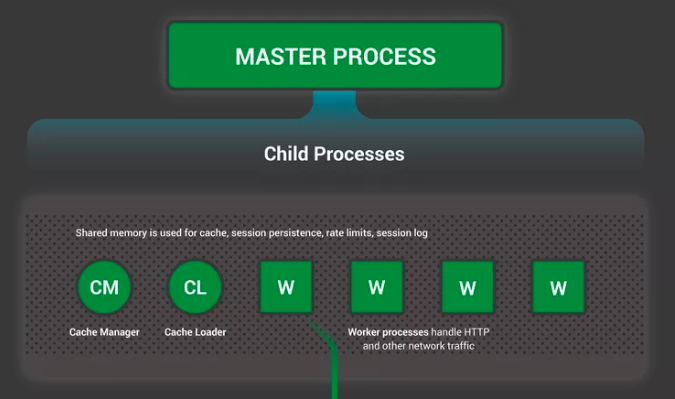
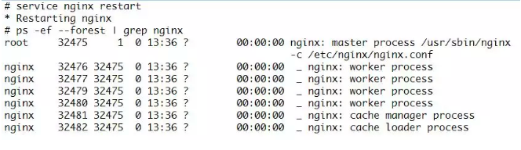
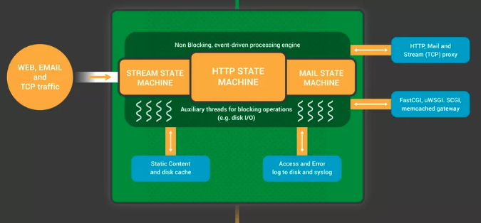
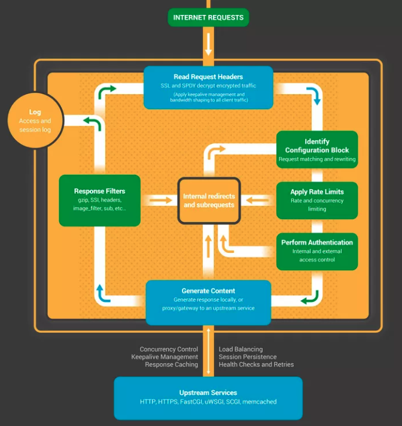
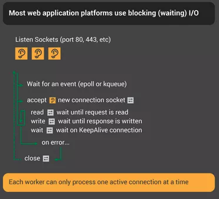
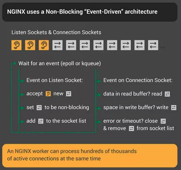
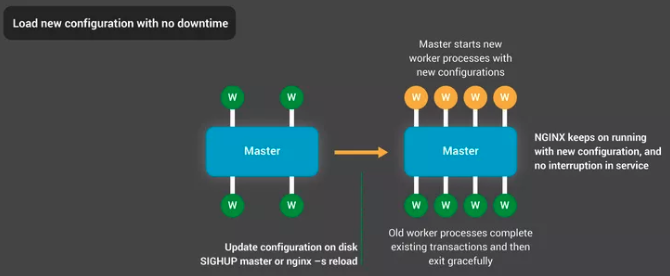
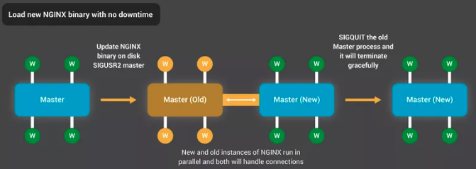

>作者：乔永琪
原文：http://blog.jobbole.com/88766/

NGINX 在网络应用中表现超群，在于其独特的设计。许多网络或应用服务器大都是基于线程或者进程的简单框架，NGINX突出的地方就在于其成熟的事件驱动框架，它能应对现代硬件上成千上万的并发连接。

NGINX 内部信息图从进程框架的顶层开始，向下逐步揭示NGINX如何处理单个进程中的多个连接，并进一步探讨其工作机制

## 场景设置 — NGINX进程模型



为了更好地理解这种设计模式，我们需要明白NGINX是如何运行的。NGINX拥有一个主线程，用来处理配置文件的读取、端口的绑定等特权操作，以及一组工作进程、辅助进程。



在这个四核服务器中，主线程创建了四个工作进程和一组缓存辅助进程（cache helper processes），后者用来管理硬盘缓存。

## 为什么框架如此重要？

任何Unix应用的基础是线程或者进程-对于Linux操作系统，线程和进程几乎相同；最大的区别在于线程间是内存共享的。一个线程或者进程是一套指令集(self-contained set of instructions )，操作系统调度这些指令在单个CPU内核上运行。许多复杂应用并行地运行在多个线程或者进程，原因有二：

* 应用可以同时使用计算机的多个CPU核

* 线程和进程易于并行操作，比如同时处理多个连接

进程和线程消耗资源，比如对内存以及其它操作系统资源的占用、内核切换(wapped on and off the cores)(本操作叫做一次上下文切换(context switch))。如今的服务器需要同时处理成千个小的、活跃线程或者进程，一旦内存耗尽、或者过高的读写负载，这些都会导致大规模的上下文切换，性能会严重退化。

通常的设计思路是，网络应用为每个连接分派一个线程或者进程。这类框架简单易于实现，不过在同时应对成千上万个连接时难以扩展。

## NGINX是如何运作的呢？

NGINX利用一个预测进程模型调度可用的硬件资源：

* 主进程处理配置文件读取、端口绑定等特权操作，以及创建一小组子进程(接下来三种类型的进程)

* 启动时缓存加载器进程加载硬盘中缓存到内存中，接着退出。对它的调度是保守的，所以资源开销较低

* 缓存管理进程定时运行，清理来自硬盘缓存的实体到指定的大小

* 工作进程负责所有的工作，处理网络连接、硬盘读写操作、以及上游服务器通信

NGINX推荐的配置是，一个工作进程对应一个CPU内核，确保硬件资源的有效利用，在配置文件中设置worker_processes auto：

```
worker_processes auto;
```

一旦NGINX服务起来，仅有工作进程在忙，每个工作进程采用非阻塞地方式处理多个连接，降低上下文切换的次数。

每个工作进程都是单线程且独立运行，负责获取新连接并进行处理。进程之间通过共享内存进行通信，诸如缓存数据，会话持续化数据(ession persistence data),以及其他共享资源。NGINX1.7.11及以后的版本，有一个可选的线程池，工作进程将阻塞操作丢给它们。更多细节，参看《Nginx 引入线程池，提升 9 倍性能》（http://blog.jobbole.com/87988/）。对于NGINX Plus用户，这些新特性会在今年的发布版7中出现。

## NGINX内部工作进程



每个NGINX工作进程由配置文件对其进行初始化，主进程为其提供一组监听socket。

工作进程起始于socket监听事件(accept_mutex 和 kernel socket sharding)，事件由新的连接进行初始化，接着这些连接被派发给某个状态机—HTTP状态机是其中最常用的一种，不过NGINX也实现了基于流的状态机、基于通信协议的状态机(SMTP, IMAP, and POP3)。



状态机是一组重要的指令集，它会告诉NGINX怎样处理每个请求。许多网络服务器拥有NGINX的状态机一样的功能—区别就在于它们的实现不同。

## 调度状态机

状态机就像下象棋，单个HTTP事务如同一盘棋。棋盘的一端是网络服务器—就像大师级棋手非常快地做出决定，另一端为远程客户端—网络浏览器通过相对较慢的网络访问某个站点或应用。

不过游戏规则可能非常复杂，比如网络服务可能需要和第三方、或者某个认证服务器通信，甚至服务器中的第三方模块来扩展游戏规则。

### 阻塞状态机

回到前面的描述，进程或者线程作为一套指令集，操作系统调度其运行在某个CPU内核上。大多数网络服务器和网络应用按照一个进程处理一个连接，或者一个线程处理一个连接的模型来玩象棋游戏；每个包含指令的进程或者线程参与游戏的整个过程。在这期间，运行在服务器上进程大多数时间被阻塞掉了，即等待某个客户端去完成下一步棋。 



1. 网络服务器进程监听socket上的新连接，此游戏新连接由客户端发起。

2. 一旦获得新游戏，进入游戏环节，每一次移动都需等待客户端响应，进程就被阻塞了。

3. 一旦游戏结束，网络服务器进程就会查看客户端是否想再来一局(对应某个存活的连接)。一旦连接关闭(客户端离开或者超时)，网络服务器进程就会返回监听新的游戏。

记住每一个活跃的HTTP连接即每一局象棋游戏，需要象棋大师一般的特定进程或者线程参与其中。这个架构简单易于扩展第三方模型即新的规则。然而，这里存在一个极不平衡的逻辑，对于相关轻量级的HTTP连接，由单个文件描述符和少量的内存表示，此连接会映射到某个线程或进程上，而线程或者进程是一个重量级的操作系统对象。尽管编程时很方便，但浪费却是巨大的。

### NGINX是一个真正的大师

或许你听说过同时展示游戏，一个象棋大师同时对阵十二个棋手。

NGINX工作进程也是这么玩”象棋”的，每个工作进程-一个CPU内核上的工作者-即是一个可以同时应对成千上万游戏的大师。



1. 工作进程从已连接并开始监听的套接字(socket)那里获取事件；

2. 一旦socket接收到事件，工作进程会立即处理此事件：

    * socket上的某个监听事件即客户端开启一个新的象棋游戏，而工作进程创建一个新的socket连接。

    * socket连接上的某个事件即客户端走了一步棋，工作线程做出了恰当地响应。

工作进程从来不会阻塞在网络传输上等待它的对手（客户端）回复应答。每走完一步棋后，工作进程会迅速处理其它等待的象棋游戏，或者欢迎新的游戏玩家进入。

### 为何比阻塞、多进程框架快呢？

NGINX良好的扩展性在于其支持一个工作线程处理成千上万个连接。每个新连接创建文件描述符，仅消耗工作进程很少一部分额外内存，额外的开销很小。进程能够一直绑定CPU(pinned to CPUs)，这样上下文切换相对没有那么频繁，只有没工作时才会发生。
译者注：cpu绑定是指绑定一个或者多个进程到一个或者多个处理器上.

使用阻塞方式，即一个连接对应一个进程，每个连接需要大量的额外资源以及开销，上下文切换非常频繁。

只要恰当的系统调优，NGINX每个工作进程可以处理成千上万个并发HTTP连接，毫无差错地应对网络高峰，即同时可以玩更多的象棋游戏。

### 更新配置文件升级NGINX

进程框架拥有少量工作进程，有利配置文件甚至二进制文件更新。



更新NGINX配置是一个简单、轻量级的可靠操作。即只要运行nginx -s reload命令，就会检查磁盘上的配置文件，并给主进程发送一个SIGHUB信号。

一旦主进程接受到一个SIGHUB,它会做两件事：

1. 重载配置文件、创建一组新的工作进程，新创建的工作进程立即接受连接、处理网络通信( 采用新的配置环境)。

2. 通知旧的工作进程优雅地推出，这些工作进程停止接受新连接。一旦当前处理的HTTP请求结束，工作进程会关闭连接。一旦所有连接关闭，工作进程就会退出。

重载进程会引起一个小的CPU和内存高峰，不过从活跃连接处加载的资源相比，开销微乎其微。每一秒可以多次重载配置文件。产生诸多等待连接关闭的NGINX工作进程一般很少出问题，不过就算是有问题也可以迅速解决。

NGINX二进文件升级获得极佳的高可用性-你可以在线升级文件，而且不会丢失任何连接、服务也不会停机或中断。
译者注： on the fly 程序在运行时，工作就可以完成。



二进制文件升级进程方式类似优雅的配置文件重载；新的NGINX主进程和原有的主进程并行，分享监听socket。两个进程都处于活跃状态，处理它们各自的网络通信。你可以通知原有的主进程以及它的工作进程优雅地退出。

## 最后结语
NGINX内部信息图展示了NGINX的高标准功能全景图，简单解释的背后是十多年来不断创新优化，得益于此NGINX被广泛应用于各种硬件平台，并且取得了最优异的性能表现。即便是在现代，网络应用需要对安全和可靠性作出维护，NGINX也表现不凡。