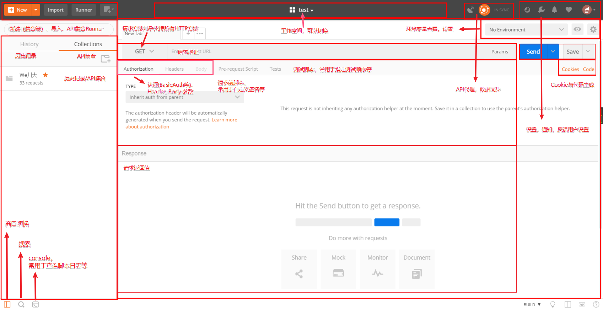
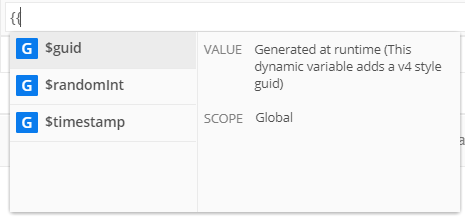

[原文链接](https://lailin.xyz/post/45050.html)

POSTMAN 是我在开发过程当中最常用到的 API 测试工具之一，虽然并不完美，但也是目前个人认为在API测试时最好用的客户端工具之一。

本文适用于后端，前端，移动端以及测试的同学，分三大部分从最简单的界面操作开讲，然后涉及到变量、脚本以及一些云服务相关的功能，最后将适配几个案例讲解怎么使用 POSTMAN 提高我们的工作效率。本文前半部分包含较多基础功能讲解，对已经比较熟悉使用的同学，可以选择性的跳过部分内容。

> PS: 本文包含大量示例图片，大屏食用效果最佳，postman 看这一篇文章就够用了

## 零、序
我所有的文章基本都来自平时开发中的需求，前段时间在公司通过网关调用接口，测试很麻烦，然后就想使用在本地直接调用，由于有签名机制，所以需要通过SDK进行调用，后面比较完整的看了一下postman的文档，感觉发现了新大陆。

> 注: 本文会介绍postman的常用以及不太常用的高级用法，但是不会所有方面都去做细节介绍，希望可以起到的抛砖引玉的作用

## 一、简要介绍
`postman`是一款强大的API接口测试工具，有chrome app、chrome 扩展、桌面版，推荐使用最新最强大的桌面版本。主要包括以下功能，本文也会围绕以下功能点展开讲解:

> 有 ☁ 标识表示为云服务

1. API测试
2. 变量
3. 代码生成
4. Script
5. API代理
6. ☁️ API文档
7. ☁️ Mock Server
8. ☁️ 接口监控
9. ☁️ Postman API
## 二、正文
### 2.1、使用简介
如下图所示，postman 界面十分丰富，基本上所有常用的功能都能一览无余



### 2.2、API 测试
如下图所示，API 测试页面十分的易用，操作界面一目了然。


### 2.2.1、认证
接口的调用常常需要通过登录，postman 预设一些常见的认证方式，比较常用的 Basic Auth, OAuth2.0 等，这些预设的协议在实际使用过程中会十分的有用。


通过上图我们可以发现，默认选项是从父目录中继承，所以如下图所示，其实我们可以在一个 Collection 或者是下面的文件夹中设置认证方式，这时候整个目录下的所有的 API 默认都可以通过认证


### 2.2.2、参数
所有 K-V 模式的参数都可以批量编辑, 包括QueryString, Body, Header, 批量编辑的功能可以快速复制浏览器中的请求参数信息到 postman 中


### 2.3、变量
postman 中一共存在五种变量类型， 全局变量，Collection/文件夹中的变量，环境变量，数据变量，本地变量


如图所有变量层级从外到内，如果出现重复的变量名，里面的会覆盖外部的变量

####  2.3.1、变量设置
#####  2.3.1.1、Collection 变量
点击编辑 Collection，如图所示

INITIAL VALUE: 这个值是用于分享给团队的成员的时候展示的值

CURRENT VALUE: 表示当前实际的值


#####  2.3.1.2、环境变量 & 全局变量
环境变量和全局变量的设置在 postman 的右上角，设置界面和上图的Collection界面类似


#### 2.3.2、变量的使用
变量通过 , 在实际请求的时候变量可以设置为实际的值，变量也可以被脚本设置, 修改, 读取, 这个特性能够让我们有了很多可能


#### 2.3.3、动态变量
postman 预设了几个动态变量, 可以获取当前的时间戳等信息



### 2.4、代码生成
如图所示，postman 提供了很多语言以及一些常用框架的代码，我们在实际使用的过程中，可以直接复制代码节约许多时间


### 2.5、Script(划重点)
#### 2.5.1、简介
在 POSTMAN 中，你可以通过编写 JavaScript 脚本增强其功能，POSTMAN 的脚本运行在其提供的沙盒环境中，如下图所示，点击左下角按钮可以出现调试窗口，会显示脚本的 debug 信息


在 postman 中一共支持两种脚本，分别是 Pre Request Script, Test Script，这两种脚本分别在请求前以及请求后生效，第一种我常用于生成各种签名或者是需要提前请求获取一些 token，后面一种更常见于集成测试中，用于控制测试的前后顺序，例如后面会讲到的案例，在 CD 前集成接口回归测试，确保主流程无误再上线等。


#### 2.5.2、API
postman 提供了一些 API，`pm.*`, 例如:


```
pm.global.* # 全局变量相关
pm.environment.* # 环境变量相关
pm.request.* # 请求相关, 注意请求相关的信息时只读的不能修改
pm.sendRequest() # 发送请求

# 下面这些只能用于 test script
pm.response.* # 返回值相关
pm.cookies.* # cookies
pm.test() # 执行测试
...
```

除此之外还内置了一些常用的 npm 包可以直接使用，例如:


```
ajv → v6.6.2
atob → v2.1.2
btoa → v1.2.1
chai → v4.2.0
cheerio → v0.22.0
...
```

更多 API 信息可以访问官方文档查看: [Postman Sandbox API reference](https://learning.getpostman.com/docs/postman/scripts/postman_sandbox_api_reference)

#### 2.5.3、Pre Request Script
请求前执行该脚本，一般用于提前设置一些签名信息，上文提到过虽然 postman 将请求的信息暴露给了我们，但是我们并不能修改，那我们要如何才能够将我们生成的值放在请求之中呢？

答案是： 变量，如果签名信息仅在 header 之中使用，也可以直接插入新的 header 信息

下面我们来看一个例子

调用第三方服务的时候往往需要生成一个 Token 进行鉴权，这个示例会分别生成一个时间戳，以及利用自带的`CryptoJS`库进行AES加密签名，并且分别使用设置环境变量，新增header的方式注入到请求之中


```
// 从环境变量中获取密钥与appid
let secret = pm.environment.get("secret")
let appid = pm.environment.get("appid")

// 获取当前时间戳
let time = new Date().getTime()
console.log("time:", time+'')

// 直接向 Header 中插入一条新的记录
pm.request.headers.upsert({key: "time", value: time})

// 签名
let sign = CryptoJS.AES.encrypt(time + appid, secret)

// 设置环境变量
pm.environment.set("sign", sign.ciphertext.toString().toUpperCase());
```


#### 2.5.4、Test Script
测试脚本和一半的单元测试大同小异，这里简要介绍比较常用和重要的两个功能，详细了解可以点击查看文档

- 基本的测试语句


```
pm.test("测试名称", function () {
    // 断言
    pm.expect(pm.response.responseTime).to.be.below(200);
});
```

- 流程控制，可以对API测试的顺序进行控制


```
// 设置下一个会被执行的请求
postman.setNextRequest("request_name");
// 终端流程
postman.setNextRequest(null);
```

运行一共有两种方式，分别是 Collection Run 以及 newman cli 执行， newman会在后文的案例之中提到


可以看到执行结果详细的信息，也可以导出


### 2.6、API 代理
这个功能对于客户端调试的同学十分有用，可以通过 POSTMAN 提供的代理功能，将客户端的请求保存在历史记录或者是一个 Collection 中

首先我们在 POSTMAN 进行如下设置，点击 Filters 还可以对请求的方法，URL进行一些过滤的操作


接下来，以安卓手机为例，我们需要和电脑处于同一网段，并且在WIFI设置里加上代理


然后再到我们之前设置的 Collection 中就可以看到请求的记录了，如下图所示在手机上设置了代理之后访问了一下百度，所有的请求链接以及参数都会展示在 postman 中


### 2.7、☁️ API 文档
接下来，将会是云服务相关的功能，如果不能使用云服务这一趴可以跳过


如图所示文档发布成功之后，即可看到文档的详情，已经API详情，并且右侧有代码生成器，可以直接复制对应的代码，十分方便


详细示例可以点击查看 [We川大 API](https://documenter.getpostman.com/view/364695/RWaGUpsy?version=latest) ，需要注意的是截止到文章发布时，postman 对免费账户文档有一定的限制每月公开文档只能有 1000 的访问

### 2.8、☁️ Mock Server
同样十分的简单，右键 Collection 点击 mock 并按照如图所示，进行一些简单的配置即可，注意 mock server 的数据是请求的时候 save example的数据，并且同样免费账户，一个月只能调用 1000 次 API，可以点击查看 We川大 API ，里面的文档示例就是使用的 Mock Server
postman2


### 2.9、☁️ 接口监控
同样十分的简单，右键 Collection 点击 monitor collection并按照如图所示进行一些配置，可以选择 频率，接口监控的位置，触发时间等字段


### 2.10、☁️ Postman API
除此之外 POSTMAN 还提供开放的 API 使其有更多的可能，如图所示获取 API Key，具体的使用请点击查看 API 文档， 通过API 我们可以实现一些自动化的操作，也可以自动生成文档，然后用 github pages 进行部署，不受账户限制等等，由于文章篇幅有限，这里就不展开讲了。


## 三、使用案例
### 3.1、和 CI/CD 联动，进行接口自动化测试
postman 提供了一个命名行工具，newman, 通过它我们可以在我们的 CI /CD 的流程上加入接口自动化回归的流程，确保服务的稳定性

接下来，我们以 gitlab ci/cd 为例，配置一个简单的接口回归

newman 具体的使用方法可以查看官方的文档或者是[github 仓库](https://github.com/postmanlabs/newman)的介绍, 这里不再赘述，我们直接看一下简单的使用

首先是 `.gitlab-ci.yml` 的配置


```
stages:
    - test

api_test:
    stage: test
    image: node:11.15.0
    before_script:
      - npm install -g newman
    script:
      # 此处执行的是官方的一个例子，run 后面可以是导出的Collection的文件，也可以是分享出来的Collection
      - newman run "https://www.getpostman.com/collections/631643-f695cab7-6878-eb55-7943-ad88e1ccfd65-JsLv"
    tags:
      - gitlab-org
```

如下图所示我们可以看到具体的执行结果，返回的信息也比较详细，和上文的 Test Script 脚本结合就可以达到我们想要的接口回归测试的效果


[点击可以查看这个demo](https://gitlab.com/mohuishou/postman-ci/pipelines)

### 3.2、本地接口文档
在上文我们有提到过，postman 的云文档比较好用，但是免费账户的限制比较大，并且很多时候在公司我们不能使用一些云的功能，这个时候，我们就可以通过导出 postman collection 并且使用一些第三方的工具，或者是自己实现一个接口文档的生成功能，来达到输出本地文档的目的

这里我们借助 [docgen](https://github.com/thedevsaddam/docgen) 这个轮子来输出一份本地的文档，类似的工具还有许多，实现上也不复杂，如果有格式上的一些需求完全可以一两个小时的功夫造出一个还能用的小工具


```
# 只需要导出json文件，就可以输出在线文档，或者是生成html，markdown 文件了
$ ./docgen.exe server -f We川大.postman_collection.json
2019/07/12 00:30:51 Listening on port:  9000
2019/07/12 00:30:51 Web Server is available at http://localhost:9000/
```

生成的效果如下图所示：


## 总结
这篇文章拖的稍微有点点久，内容有点超出最开始的预计，写的稍稍有点点多了，POSTMAN 还有需要有用的玩法，大家可以探索一下，除了上文讲到的之外，说一些我常用到的方式

- 利用 collection run 批量提交请求，做一些批处理的工作
- 利用 pre request script 设置在 Collection 中，然后用不同的环境变量区分不同的项目，这种用在网关类的测试十分有
文章比较长，感谢你的阅读

参考资料
1. [Postman官方文档，很全面，基本上所有的操作都能在上面找到](https://learning.getpostman.com/docs)
2. [Postman 高级用法](https://haofly.net/postman/)
3. [Postman高级应用（9）：API收集神器——请求拦截](https://www.twblogs.net/a/5bddb8542b717720b51ab853/zh-cn)
4. [We川大 API](https://documenter.getpostman.com/view/364695/RWaGUpsy?version=latest)
5. [newman](https://github.com/postmanlabs/newman)
6. [gitlab ci demo](https://gitlab.com/mohuishou/postman-ci/pipelines)
7. [docgen](https://github.com/thedevsaddam/docgen)