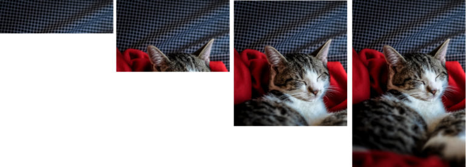

从图片优化说起
===

[原文链接](https://cjting.me/2019/07/29/image-optimization/)

图片是大部分网页的重要组成部分，一般情况下，我们不会太关注这方面的问题，需要显示图片直接一个 img 标签搞定。

但实际上，无论是对于提高加载速度，还是对于优化用户体验，优化图片都是一个重要的手段。

图片优化分成两个方面：

第一，图片压缩。在保证视觉效果的情况下，减少图片的体积。这个很有效，1M 和 100K 的图片，肉眼看起来几乎差不多，但却省了 90% 的流量，大大提高了加载速度。

第二，响应式图片。根据客户端的情况，选择最合适的图片返回给用户。用户是一个 500px 的设备，那么返回 1000px 的图给他就是浪费（假设物理像素和 CSS 像素是一比一）。

我们先来看图片压缩。

图片压缩
---
压缩的第一步是筛选出需要压缩的图片。如果图片本身就已经足够小了，那么再压缩的意义就不大。

我一般使用如下的脚本筛选项目中需要压缩的图片。脚本会列出所有的图片并根据尺寸降序排列。
```
# fd 是现代化的 find
# bat 是现代化的 cat
fd -e png -e jpeg -e jpg -e svg |\
xargs ls -l |\
sort -nk5 -r |\
awk '{print $9,$5}' |\
numfmt --field=2 --to=iec |\
column -t | bat
```


筛选出需要压缩的图片以后，接下来就是压缩、比对、调整参数。图片压缩的工具实在是太多了，Google image compression tool 选择会多得你眼花缭乱。

这里顺口提一下 Google 出品的 [squoosh](https://squoosh.app/) 在线图片压缩服务，看起来不错，虽然我没怎么用过。

这里我选择使用 [imagemin](https://github.com/imagemin/imagemin)，相比于一些在线工具或者 App，自己写脚本更灵活一些。

程序很简单，分别针对 JPG、PNG、SVG 加载相应的插件就好。
```js
const imagemin = require("imagemin")
const imageminMozjpeg = require("imagemin-mozjpeg")
const imageminPngquant = require("imagemin-pngquant")
const imageminSvgo = require("imagemin-svgo")

;(async () => {
  const files = await imagemin(process.argv.slice(2), {
    destination: "dist",
    plugins: [
      imageminMozjpeg({
        quality: 70,
      }),
      imageminPngquant({
        quality: [0.65, 0.8],
      }),
      imageminSvgo({
        plugins: [
          {removeViewBox: false},
        ],
      }),
    ],
  })
})()
```
注意，`quality` 参数需要自己测试去确定，怎样在质量和尺寸中权衡，每个团队有自己的标准。

Progressive JPEG VS Baseline JPEG
---
JPEG 根据显示方式的不同，分为两种。Progressive JPEG 会先加载模糊的整张图片，然后变的越来越清晰。


而 Baseline JPEG 会先清晰地加载图片的一部分，然后慢慢显示剩余的部分。





从视觉效果来说，Progressive JPEG 自然更好一些。但它也有一些缺点，比如它的解码速度比 Baseline JPEG 要慢，占用的 CPU 时间更多。

如果是桌面浏览器，这点性能问题自然无所谓，但是如果是移动端，就不得不考虑。工程本来就是权衡的艺术。

默认情况下，MozJPEG 生成的是 Progressive JPEG，可以通过 [选项](https://github.com/imagemin/imagemin-mozjpeg#progressive) 调整。

WebP
---
WebP 是谷歌新提出的一个图片格式，拥有质量好尺寸小的特点。在客户端支持的情况下，我们应该尽可能地使用 WebP 格式。

有很多工具可以将 JPG/PNG 转换成 WebP，这里还是使用 imagemin 为例。
```js
const imageminWebp = require('imagemin-webp')

const webps = await imagemin(images, {
  destination: "dist",
  plugins: [
    imageminWebp({
      quality: 80,
    }),
  ],
})
```
oimg
---
[oimg](https://github.com/cj1128/oimg) 是我在 imagemin 的基础上封装的一个命令行小工具，毕竟压缩图片是经常要做的事情，不能每次都等到需要的时候再去写脚本。

oimg 使的流程是这样的：

* 首先，我们找到尺寸比较大的需要压缩的图片
* 然后，使用 oimg 压缩
* 最后，肉眼对比一下原图片和压缩图片，如果没有问题，替换就好
* 如果效果不满意，调整参数，再压缩

这个过程没法完全自动化，因为压缩过后的图片究竟在视觉上能不能替换原图，这个过程需要人来判别，全部交给机器是不太放心的。毕竟只有在保证质量的情况下减小体积才有意义。

oimg 的输出如下，可以很方便地看出压缩的效果如何。


响应式图片
---
图片压缩的问题解决完了，现在我们来看看响应式图片。

所谓响应式图片，关键就一点：`根据客户端的情况返回最适合客户端的图片`。

那么，可能会存在哪些情况？在准备部署响应式图片的时候，我们可以问自己如下四个问题。

* 是否希望根据客户端情况返回不同的图片 `内容`?
* 是否希望根据客户端情况返回不同的图片 `格式`？
* 是否希望根据客户端情况返回不同的图片 `尺寸` ？
* 是否希望优化高 `分辨率` 设备的体验？

在 picture 标签出来之前，这些只能通过 JS 来实现，不仅代码而且丑陋能力也不全。但是现在，针对这些问题，我们有了一个完整的优雅的解决方案。

`picture` 标签
picture 是 HTML5 新引入的标签，基本用法如下。
```html
<picture>
  <source srcset="a.jpg">
  <source srcset="b.jpg">
  
</picture>
```

我们可以这样理解，`picture` 标签会从 `source` 中选择最合适的一个，然后将它的 URL 赋值给 `img`。对于不认识 `picture` 的旧浏览器，他们会忽略 picture，只渲染 img，一切都不会有问题。

注意：**picture 标签最后一定要包含一个 img 标签，否则，什么都不会显示。**

现在我们逐一来看 `picture` 怎样解决上面的四个问题。

动态内容
---
根据客户端的情况，我们来返回完全不同的两张图。这个很简单，使用 `source` 标签的 `media` 属性即可。

如下代码会在小于 1024px 的时候显示 `img-center.jpg`，而在大于等于 1024px 的时候显示 `img-full.jpg`。
```html
<picture>
  <source
    media="(min-width: 1024px)"
    srcset="img-full.jpg"
  >

  
</picture>
```
动态格式
---
这个问题也很简单，使用 `source` 标签的 `type` 属性即可。

如下代码会在支持 WebP 的浏览器上使用 `img.webp`，在不支持 WebP 的浏览器上使用 `img.jpg`。
```html
<picture>
  <source
    srcset="img.webp"
    type="image/webp"
  >

  
</picture>
```
动态尺寸
---
如果希望浏览器能根据情况去请求不同尺寸的图片，我们需要提供两个信息：

* 有哪些尺寸的图片
* 图片显示的时候是什么尺寸
下面的代码中，我们首先使用 `srcset` 属性指定有哪些图片，分别是图片名和图片的尺寸，这里注意单位不用 `px` 而是 `w`，用于表示图片的固有宽度。

`sizes` 属性告诉浏览器，这个图片在不同的条件下会是什么样的宽度。这个属性用于给到浏览器提示，并不会真正的指定 `img` 的宽度，我们还是需要另外使用 CSS 来指定。

这样，给定一个视口宽度，浏览器可以得知图片需要的宽度，然后根据 DPI 情况，在所有可选图片中选择最合适的一个。
```html

```
动态分辨率
---
动态分辨率其实是动态尺寸的一种简化情况。

根据显示器的 DPI 返回同一张图片的不同分辨率版本可以直接利用 `img` 标签的 `srcset` 属性。

使用了如下的代码，浏览器会自动根据显示器的 DPI 来决定下载图片的哪个版本。

在低 DPI 设备上，例如桌面显示器，浏览器会使用 img-200.jpg，而在高 DPI 设备上，例如手机，浏览器会使用 img-400.jpg。
```html


<style type="text/css">
  img {
    width: 200px;
  }
</style>
```
当然，我们也可以组合这几个选项。

如下的代码会

- 视口 >= 1280px 时
    * 根据视口的具体宽度，返回不同尺寸的 img-full 图片
    * 如果客户端支持 WebP，返回 WebP 格式
- 视口 < 1280px 时
    * 根据视口的具体宽度，返回不同尺寸的 img 图片
    * 如果客户端支持 WebP，返回 WebP 格式

```html
<picture>
  <source
    media="(min-width: 1280px)"
    sizes="50vw"
    srcset="img-full-200.webp 200w,
        img-full-400.webp 400w,
        img-full-800.webp 800w,
        img-full-1200.webp 1200w,
        img-full-1600.webp 1600w,
        img-full-2000.webp 2000w"
    type="image/webp"
  >
  <source
    media="(min-width: 1280px)"
    sizes="50vw"
    srcset="img-full-200.jpg 200w,
        img-full-400.jpg 400w,
        img-full-800.jpg 800w,
        img-full-1200.jpg 1200w,
        img-full-1600.jpg 1800w,
        img-full-2000.jpg 2000w"
  >

  <source
    sizes="(min-width: 640px) 60vw, 100vw"
    srcset="img-200.webp 200w,
        img-400.webp 400w,
        img-800.webp 800w,
        img-1200.webp 1200w,
        img-1600.webp 1600w,
        img-2000.webp 2000w"
    type="image/webp"
  >
  
</picture>
```
这里强烈建议自己动手，结合 placeholder.com 网站，生成一些图片来测试，毕竟，纸上得来终觉浅。

参考
[Responsive Images: Use Cases and Documented Code Snippets to Get You Started](https://dev.opera.com/articles/responsive-images)
[MDN: Responsive images](https://developer.mozilla.org/en-US/docs/Learn/HTML/Multimedia_and_embedding/Responsive_images)
[images.guide](https://images.guide/)