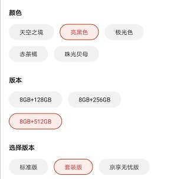
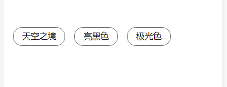
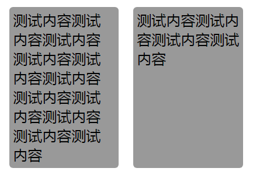
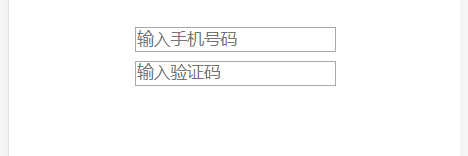

[原文链接](https://github.com/wanqihua/blog/issues/28)

## 1. 每个单词的首字母大写


其实我第一次看到这个功能的时候就是使用 JS 去实现这个功能，想都没想 CSS 可以完成这个功能。马上就屁颠屁颠的写了一个方法：
```js
function capitalizeFirst( str ) {
    let result = '';
    result = str.toLowerCase().replace(/( |^)[a-z]/g, (L) => L.toUpperCase());
    return result
}  
```
写完这个方法后，还有点小得意，也就没想其他方案。直到有一天看到 CSS 也能做这个功能的时候，我才反应过来明明一句 CSS 就能解决的问题，我却使用了更复杂的方案。

CSS 方案如下：
```css
.capitalizeFirst-css {
    text-transform: capitalize;
}
```
是不是特别简单.

**text-transform 简单介绍**
> 这是 CSS2 中的属性，参数有 capitalize | uppercase | lowercase | none

参数介绍：

- none： 默认。定义带有小写字母和大写字母的标准的文本。
- capitalize： 文本中的每个单词以大写字母开头。
- uppercase： 定义仅有大写字母。
- lowercase： 定义无大写字母，仅有小写字母。
从这个属性我们可以知道全部大写（小写）的需求这个属性也能轻易实现。

## 2. 单选高亮
可能你看到“单选高亮”没反应过来，直接来张图片你就马上清楚了：



不知道你是否第一次看到这种单选高亮的需求时，是怎么处理的。我第一次直接是用 JS 控制的。后来我发现这个需求用 CSS 更方便处理。

主要代码就是一段 CSS 代码：

```html
// 省略部分代码，详细代码看仓库
.input:checked + .colors {
  border-color: #e63838;
  color: #e63838;
}

<div class="single-check">
    <input class="input" type="radio" name="colors" value="1">
    <div class="colors">天空之境</div> 
</div>
```
看效果：



### 两个选择器的区别

`~ 选择器：查找某个元素后面的所有兄弟元素`

`+ 选择器：查找某个元素后面紧邻的兄弟元素`

### 扩展
其实这个技巧也完全可以使用在导航栏的交互效果，个人觉得可以简化一部分工作。

## 3、多列等高问题
之前做 pc 端的客户画像需求时，遇到需要左右两边等到的需求（左边块的高度会随着内容变化）。

最初我使用的 JS 计算高度再赋值，可是这样会有页面闪动的效果。所以找到了两种 CSS 的处理方案：

1. 每列设置一个很大的 padding，再设置一个很大的负的 margin
2. 使用 display: table;

第一种有明显的缺陷：

1. border-bottom 看不到了
2. 设置的下方的两个圆角也不见了
所以我使用了 `display: table; `的方式来实现等高，可以说非常的方便。


> 建议不要一味的抵触 table，有的场景还是可以使用的。

## 4、表单验证

> 先声明：这里没有用到 JS，不过用到了 HTML5 关于 <input> 的新属性 —— pattern( 检查控件值的正则表达式 )。
还有一点：其实我在实际项目中没这么用过。

代码如下：
```html
input[type="text"]:invalid ~ input[type="submit"] {
    display: none
}

<div class="form-css">
    <input type="text" name="tel" placeholder="输入手机号码" pattern="^1[3456789]\d{9}$" required><br>
    <input type="text" name="smscode" placeholder="输入验证码" pattern="\d{4}" required><br>
    <input type="submit" ></input>
</div>

```

效果如下（样式不好看的问题请忽略）：



#### invalid 伪类和 vaild 伪类
- valid 伪类，匹配通过 pattern 验证的元素
- invalid 伪类，匹配未通过 pattern 验证的元素